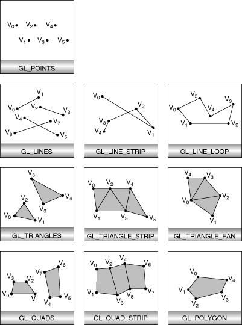

# Interactive Computer Graphics

เป็นการสรุปจาก[เอกสารคำสอน 01418382 คอมพิวเตอร์กราพิกส์เชิงโต้ตอบเบื้องต้น](https://drive.google.com/file/d/10aRr75rBQ39OxnD9QaudTF0FWoIrYOmy/view?usp=sharing)

สารบัญ

- [Interactive Computer Graphics](#interactive-computer-graphics)
- [การโปรแกรมกราฟิกส์เบื้องต้น](#การโปรแกรมกราฟิกส์เบื้องต้น)
  - [การแปลงรูปทรงเรขาคณิตให้เป็นกลุ่มพิกเซล](#การแปลงรูปทรงเรขาคณิตให้เป็นกลุ่มพิกเซล)
  - [สายท่อกราฟิกส์](#สายท่อกราฟิกส์)
    - [Vertex Processing](#vertex-processing)
    - [Primitive Processing](#primitive-processing)
    - [Fragment Generation](#fragment-generation)
    - [Fragment Processing](#fragment-processing)
    - [Screen Sample Operations](#screen-sample-operations)
- [การเรนเดอร์ด้วย OpenGL](#การเรนเดอร์ด้วย-opengl)
  - [OpenGL and PyOpenGl](#opengl-and-pyopengl)
  - [GLUT Library](#glut-library)
  - [การวาดรูปทรงเรขาคณิตพื้นฐานด้วย OpenGL](#การวาดรูปทรงเรขาคณิตพื้นฐานด้วย-opengl)
- [Animation](#animation)
  - [Single Buffering](#single-buffering)
  - [Double Buffering](#double-buffering)
  - [Animation with GLUT](#animation-with-glut)
  - [Depth Buffer](#depth-buffer)
  - [Depth Test](#depth-test)
  - [Depth Buffer in GLUT](#depth-buffer-in-glut)
- [Linear Algebra for Graphics](#linear-algebra-for-graphics)
  - [Point, Vector, and Scalar](#point-vector-and-scalar)
  - [Vector Operations](#vector-operations)
- [3D Tranformation in OpenGL](#3d-tranformation-in-opengl)

# การโปรแกรมกราฟิกส์เบื้องต้น

## การแปลงรูปทรงเรขาคณิตให้เป็นกลุ่มพิกเซล

เริ่มขั้นตอนจากการประมวลผลบนจุดมุมของสามเหลี่ยมที่เรียกว่า vertex เมื่อถูกนำมาเชื่อมต่อกันด้วยเส้นตรง ก็จะประกอบกันเป็นสามเหลี่ยม ซึ่งครอบคลุมบริเวณภายในรูปภาพตามค่าพิกัดของจุดเวอร์เท็กซ์ แต่เนื่องจากว่าการแสดงผลบนจอภาพมีความไม่ต่อเนื่อง (discrete) สามเหลี่ยมจึงต้องถูกนำไปคำนวณหาตำแหน่งของกลุ่ม fragment ที่สามารถครอบคลุมบริเวณภายในสามเหลี่ยมนี้ได้ แฟรกเมนต์มีลักษณะเป็นสี่เหลี่ยมขนาดเล็กที่สามารถนำมาแสดงผลบนจอภาพได้ แฟรกเมนต์เหล่านั้นเรียกว่า pixel

## สายท่อกราฟิกส์

การแปรงรูปทรงเรขาคณิตพื้นฐานให้กลายเป็นกลุ่มพิกเซลได้ถูกออกแบบขั้นตอนการประมวลผล เพื่อเพิ่มประสิทธิภาพในการคำนวณ โดยแบ่งการคำนวณออกเป็นส่วนประมวลผลต่าง ๆ ที่เรียกว่าสายท่อกราฟิกส์ สายท่อออกเบน 5 ส่วน โดยที่แต่ละส่วนจะรับข้อมูลเข้ามาเพื่อทำการคำนวณตามหน้าที่ที่ถูกกำหนดไว้ แล้วส่งผลคำนวณที่ได้ไปเป็นข้อมูลนำเข้าของสวนถัดไป


### Vertex Processing
ส่วนแรกของการคํานวณในสายท่อกราฟิกส์เรียกว่า Vertex Processing ซึ่งการทำงานในส่วนนี้จะรับข้อมูล ส่วนประกอบของรูปทรงเรขาคณิตเข้ามาประมวลผลข้อมูลของแต่ละ vertices โดยการประมวลผลจะเป็นแบบขนานเพื่อเพิ่มกำลังการประมวลผลให้กับหลาย vertices ในคราวเดียวกัน และโปรแกรมเมอร์สามารถควบคุมการคำนวณนี้ผ่านการโปรแกรมคำสั่งให้กับหน่วยประมวลผลกราฟิกส์ (GPU) ส่วนนี้ ลักษณะของการคำนวณส่วนนี้ที่เรามักจะพบกันจะเป็นการแปลงค่าพิกัดจุดเวอร์เท็กซ์ให้อยู่ภายในปริมาตรการมองเห็นที่กำหนด การคำนวณค่าให้กับจุดเวอร์เท็กซ์เมื่อได้รับการส่องสว่างจากแสง และการกำหนดค่าพิกัดเท็กซ์เจอร์ให้กับจุดเวอร์เท็กซ์ เป็นต้น หลังจากผ่านการคำนวณแล้ว ส่วน Vertex Processing จะส่งข้อมูลที่คำนวณได้ออกไปยังส่วนถัดไปในสายทอ ดังปรากฏในรูปที่แสดงตัวอย่างของจุดเวอร์เท็กซ์ 4 จุดได้ถูกส่งเข้ามาในสายต่อเพื่อใช้ในการวาดสามเหลี่ยม 2 อันโดยหลังจากที จุดเวอร์เท็กซ์ทั้ง 4 ผ่านการประมวลผลแล้ว ข้อมูลจุดเวอร์เท็กซ์จะถูกส่งต่อไปยังส่วนถัดไป

### Primitive Processing

ส่วนถัดไปในสายห่อกราฟิกส์เป็นส่วน Primitive Processing ซึ่งจะนำข้อมูลที่คำนวณได้จากส่วนก่อนหน้ามาประกอบกันเป็นรูปทรงเรขาคณิตพื้นฐานตามที่กำหนดไว้ เช่น สี่เหลี่ยม สามเหลี่ยม หรือเส้นตรง เป็นต้น 

### Fragment Generation

ข้อมูลรูปทรงเรขาคณิตพื้นฐานจะถูกส่งผ่านสายท่อไปยังส่วน Fragment Generation หรือ Rasterization เพื่อใช้คำนวณหาองค์ประกอบย่อยที่มีรูปทรงสี่เหลี่ยมจัตุรัสขนาดเล็กที่เรียกว่าแฟรกเมนต์ (fragment) ที่จะปรากฏอยู่ภายในรูปทรงเรขาคณิตพื้นฐานที่กำหนด โดยถูกส่งผ่านออกมาในรูปของสายข้อมูลแฟรกเมนต์ (Fragment Strearm)

### Fragment Processing

เพื่อส่งต่อไปยังส่วน Fragment Processing และใช้ประมวลผลให้กับข้อมูลแฟรกเมนต์ ซึ่งงานประมวลที่เรามักจะทำในจุดนี้คือ การคำนวณค่า หรือเฉดให้กับแต่ละแฟรกเมนต์ โดยโปรแกรมเมอร์สามารถโปรแกรมคำสั่งเพื่อควบคุมการคำนวณในส่วนประมวลผลได้

### Screen Sample Operations

สายข้อมูลแฟรกเมนต์ที่ถูก ออกจากส่วน Frament Processing จะถูกส่งต่อเข้าไปในส่วน Screen Sample Operations หรือที่มักจะเรียกกันว่า Pixel Operations ซึ่งจะคอยพิจารณาสถานะของแฟรกเมนต์และตรวจสอบว่า แฟรกเมนต์ใดบ้างจะกลายไปเป็นพิกเซล โดยข้อมูลพิกเซลที่ได้นี้จะถูกส่งออกจากสายท่อกราฟิกส์และถูกจัดเก็บใน หน่วยความจําที่เรียกว่า บัฟเฟอร์เฟรม (Framebuffer)ซึ่งก็คือบัฟเฟอร์หรือหน่วยความจำที่ใช้เก็บค่าสีของพิกเซล เพื่อนำไปแสดงให้ปรากฏบนจอภาพต่อไป

# การเรนเดอร์ด้วย OpenGL

การใช้ python และ PyOpenGl มาใช้สร้างโปรแกรมกราฟิกส์เบื้องต้น

## OpenGL and PyOpenGl

หน่วยความจำ บัฟเฟอร์เฟรม (framebuffer) จะถูกสร้างขึ้นให้กับ OpenGL เพื่อใช้เก็บค่าข้อมูลของพิกเซลที่ประมวลผลได้ โดย Library ที่ใช้ในการสร้างและจัดการหน้าต่างเป็นส่วนที่รับผิดชอบในการจองหน่วยความจำนี้ โดยที่ OpenGL จะใช้ framebuffer ในการเก็บข้อมูลภาพที่ OpenGL คำนวณได้

ผลจากการคำนวณของการวาดที่ได้จาก OpenGL จะถูกเก็บอยู่ใน framebuffer ในรูปค่าสีของพิกเซล ซึ่งบางครั้งเรามักจะเรียกบัฟเฟอร์นี้ว่า บัฟเฟอร์สี (color buffer) เมื่อเราเขียนโปรแกรมที่สร้างหน้าต่างขึ้นมา หน่วยความจําในอุปกรณ์การ์ดจอจะถูกจองพื้นที่เพื่อใช้จัดเก็บข้อมูลในบัฟเฟอร์สี

ตัวอย่างบัฟเฟอร์สีที่ใช้หน่วยความ ขนาด 24 บิตในการจัดเก็บค่าสีของ 1 พิกเซลโดย 24 บิตนี้จะถูกแบ่งออกเป็น 3 ส่วนเพื่อใช้เก็บค่าข้อมูลของ แต่ละแม่สี (primary color) อันได้แก่ สีแดง สีเขียว และสีน้ำเงิน ดังนั้นใน 1 พิกเซล หน่วยความจําขนาด 8 บิต (หรือ 1 ไบต์) จะใช้ในการจัดเก็บค่าข้อมูลของสีแดง อีก 8 บิตใช้ในการจัดเก็บค่าข้อมูลสีเขียว และอีก 8 ปิดใช้ในการจัด เก็บค่าข้อมูลสีน้ำเงิน ซึ่งลักษณะการจัดเก็บข้อมูลสีแบบนี้เรียกกันว่า True Color โดยสามารถจัดเก็บค่าเฉดของสี ได้จำนวนถึง 2<sup>24</sup> = 16,777,216 สี บัฟเฟอร์สีประกอบขึ้นมาจากบิดเพลน (bit plane)

แต่ละพิกเซลบนจอ Cathode Tay Tube (CRT) ถูกควบคุมด้วยค่าสีใน color buffer ซึ่งค่าข้อมูลของแต่ละสีจะถูกแปลงด้วยอุปกรณ์ Digital-to-Analog Converter (DAC) เพื่อควบคุมกำลังไฟของ color gun ที่เป็นปืนอิเล็กตรอนของแต่ละสี เมื่อยิงออกไปที่จอภาพที่ถูกเคลือบด้วยสารเรืองแสง (phosphor) บริเวณบนจอภาพที่ได้รับอิเล็กตรอนก็จะปล่อยออกมาตามกำลังไฟที่ปืนยิงออกไป การผสมกันจากการเรืองแสงจากแม่สีทั้งสามสีจะทำให้ผู้ดูสามารถเห็นสีตามที่กำหนดไว้ใน color buffer ได้

## GLUT Library

ใช้ GLUT เพื่อใช้สร้างและจัดการกับหน้าต่าง ติดต่อกับอุปกรณ์ภายนอก เช่น keyboard mouse เพื่อให้ผู้ใช้มีปฏิสัมพันธ์ได้

ตัวอย่างการสร้างหน้าต่างสีฟ้าขนาด 640 x 480

```python
import sys
from OpenGL.GL import *
from OpenGL.GLU import *
from OpenGl.GLUT import *

def display():
  glClearColor(0, 1, 1, 0)
  glClear(GL_COLOR_BUFFER_BIT)
  glFlush()

glutInit(sys.argv)
glutInitDisplayMode(GLUT_RGB | GLUT_SINGLE)
glutInitWindowSize(640, 480)
glutInitWindowPosition(50, 50)
glutCreateWindow("Window Title")
glutDisplayFunc(display)
glutMainLoop()
```

## การวาดรูปทรงเรขาคณิตพื้นฐานด้วย OpenGL

การวาดรูปทรงต่าง ๆ ด้วย OpenGL เกิดจากการกำหนดตำแหน่งของจุดเวอร์เท็กซ์ที่ประกอบขึ้นมาเป็นรูปทรงเรขาคณิตพื้นฐาน

คำสั่ง `glVertex3f(x, y, z)` ใช้กำหนดค่าพิกัดจุดมุมรูปทรงเราต้องการจะวาด และจะถูกห้อมล้อมด้วยคำสั่ง `glBegin(mode)` และ `glEnd()` โดยค่า mode เป็นค่าคงที่ที่บ่งบอกรูปทรงเรขาคณิดที่ต้องการวาด



| mode | description |
| --- | --- |
`GL_POINTS` | Draws a point at each of the n vertices. |
`GL_LINES` | Draws a series of unconnected line segments. Segments are drawn between v0 and v1, between v2 and v3, and so on. If n is odd, the last segment is drawn between vn−3 and vn−2, and vn−1 is ignored.
`GL_LINE_STRIP` | Draws a line segment from v0 to v1, then from v1 to v2, and so on, finally drawing the segment from vn−2 to vn−1. Thus, a total of n − 1 line segments are drawn. Nothing is drawn unless n is larger than 1. There are no restrictions on the vertices describing a line strip (or a line loop); the lines can intersect arbitrarily.
`GL_LINE_LOOP` | Same as `GL_LINE_STRIP`, except that a final line segment is drawn from vn−1 to v0, completing a loop.
`GL_TRIANGLES` | Draws a series of triangles (three-sided polygons) using vertices v0, v1, v2, then v3, v4, v5, and so on. If n isn’t a multiple of 3, the final one or two vertices are ignored.
`GL_TRIANGLE_STRIP` | Draws a series of triangles (three-sided polygons) using vertices v0, v1, v2, then v2, v1, v3 (note the order), then v2, v3, v4, and so on. The ordering is to ensure that the triangles are all drawn with the same orientation so that the strip can correctly form part of a surface. Preserving the orientation is important for some operations, such as culling (see “Reversing and Culling Polygon Faces” on page 61). n must be at least 3 for anything to be drawn.
`GL_TRIANGLE_FAN` | Same as `GL_TRIANGLE_STRIP`, except that the vertices are v0, v1, v2, then v0, v2, v3, then v0, v3, v4, and so on (see Figure 2-7).
`GL_QUADS` | Draws a series of quadrilaterals (four-sided polygons) using vertices v0, v1, v2, v3, then v4, v5, v6, v7, and so on. If n isn’t a multiple of 4, the final one, two, or three vertices are ignored.
`GL_QUAD_STRIP` | Draws a series of quadrilaterals (four-sided polygons) beginning with v0, v1, v3, v2, then v2, v3, v5, v4, then v4, v5, v7, v6, and so on (see Figure 2-7). n must be at least 4 before anything is drawn. If n is odd, the final vertex is ignored.
`GL_POLYGON` | Draws a polygon using the points v0, ... , vn−1 as vertices. n must be at least 3, or nothing is drawn. In addition, the polygon specified must not intersect itself and must be convex. If the vertices don’t satisfy these conditions, the results are unpredictable.

ฟังก์ชั่น `glVertex[234][bsifd][v]()` โดย `[234]` คือจำนวนพารามิเตอร์ที่จะถูกส่งผ่านเข้ามายังฟังก์ชัน ส่วน `[bsifd]` บ่งบอกประเภทของพารามิเตอร์ และหากมี `v` ต่อท้ายก็จะเป็นการส่งข้อมูลที่เป็น vector โดยจะส่งด้วย list หรือ tuple ใน python

ฟังก์ชัน `glColor[234][bsifd][v]` ใช้สำหรับการกำหนดค่าสีให้กับ vertex ถัดไป ดังนั้นให้ใช้คำสั่งนี้ก่อนการออกคำสั่ง `glVetex*()` เพื่อให้ vetex ใหม่จะถูกกำหนดตามที่ถูกกำหนดไว้ ลักษณะนี้จะเรียกว่า state machine

ตัวอย่งประเภทข้อมูล
| Suffix | data type | C | OpenGL |
--- | --- | --- | ---
b | 8-bit int | signed char | GLbyte
s | 16-bit int | short | GLshort
i | 32-bit int | int or long | GLint
f | 32-bit floating-point | float | GLfloat
d | 64-bit floating-point | double | GLdouble

# Animation

การสร้างภาพเคลื่อนไหวเป็นลักษณะของการแสดงภาพต่อเนื่อง

## Single Buffering

คือใช้ color buffer แค่ชุดเดียวเพื่อการ render การกำหนดการใช้ color buffer ลักษณะนี้ด้วยการใช้ `glutInitDisplayMode(GLUT_SINGLE)` ทำให้บางครั้งเกิดการแย่งทรัพยากร (race condition) ระหว่าง OpenGL ในการบันทึกผลลงใน color buffer และการ์ดจอที่นำข้อมูลจาก color buffer ทำให้บางครั้งเกิดจอกระพริบ (flickering)

## Double Buffering

เป็นการสร้าง color buffer ขึ้นมาสองชุด เรียกว่า front buffer และ back buffer โดยที่ OpenGL จะ render ภาพและบันทึกผลลงใน back buffer ขณะที่การ์ดจอจะนำผลการ render จาก front buffer ออกไปแสดงบนจอภาพ เมื่อ OpenGL renders ภาพเสร็จ เราจะเรียกใช้คำสั่งที่ทำการสลับตัวชี้ color buffer (framebuffer poiner) เพื่อให้ตัวชี้ของ back buffer และ front buffer สลับการชี้ไปยัง buffer ทั้งสอง จะเป็นการประกันว่า OpenGL ได้ render ภาพเสร็จเรียบร้อยก่อนที่ภาพนั้นจะถูกการ์ดจอนำไปแสดง ซึ่งช่วยแก้ปัญหาจอกระพริบได้ โดยการใช้คำสั่ง `glutInitDisplayMode(GLUT_DOUBLE)` และใช้คำสั่ง `glutSwapBuffers()` โดยที่เราไม่ต้องใช้คำสั่ง `glFlush()` อีก เนื่องจากคำสั่ง `glutSwapBuffers()` มีการเรียก `glFlush()` อยู่แล้ว

## Animation with GLUT

เพื่อการสร้างภาพเคลื่อนไหวให้กับโปรแกรม คำสั่ง `glutIdleFunc(func)` ถูกเรียกใช้เพื่อลงทะเบียนอีเวนต์ว่างงาน (idle event) เข้ากับ callback function ซึ่งจะถูกเรียกซ้ำขณะที่โปรแกรมไม่ได้ทำงานอยู่ โดยปกติแล้วการออกแบบ callback function จะมีการเปลี่ยนค่าตัวแปรต่าง ๆ ที่ใช้สำหรับการ render ซึ่งจำเป็นต้องส่ง event การวาดหน้าจอใหม่เพื่อให้ให้การแสดงผลมีการเปลี่ยนแปลง ใช้คำสั่ง `glutPostRedisplay()` 

นอกจากนั้นยังมีคำสั่งที่ใช้สำหรับการตั้งเวลา `glutTimerFunc(msecs, timer_func, value)` ดังตัวอย่างจะแสดงค่า 0 ออกมาที่จอภาพทุก 1,000 มิลลิวินาที หรือ 1 วินาที

```python
def timer(val):
  print(val)

glutTimerFunc(1000, timer, 0)
```

## Depth Buffer


การเรนเดอร์ภาพสามมิติโดยใช้ color buffer แต่เพียงอย่างเดียวอาจให้ผลภาพที่ไม่พึงประสงค์ ดังภาพ สาเหตุของปัญหานี้เกิดขึ้นมาจากการที่โมเดลกระต่ายประกอบด้วยสามเหลี่ยมขนาดเล็กเป็นจํานวนมากโดยที่ลำดับการวาดสามเหลี่ยมเป็นไปตามข้อมูลที่ถูกจัดเก็บอยู่ใน array ที่รับเข้ามาจากไฟล์โมเดล ซึ่งไม่ได้มีการจัดเรียงลำดับ การเรนเดอร์สามเหลี่ยมเหล่านี้อาจส่งผลทำให้สามเหลี่ยมที่อยู่ใกล้ตาผู้ดูถูกวาดก่อน สามเหลี่ยมที่อยู่ไกลตาผู้ดูออกไป ซึ่งทำให้เกิดซ้อนกัน

สามารถใช้บัฟเฟอร์ความลึก (*depth buffer* or *Z-buffer*) ร่วมกับ color buffer ในการเรนเดอร์ บัฟเฟอร์ความลึกเก็บค่าความลึกของ[แฟรกเมนต์](#การแปลงรูปทรงเรขาคณิตให้เป็นกลุ่มพิกเซล)โดย depth buffer จะมีขนาดที่สัมพันธ์กับขนาดของ color buffer แต่ค่าที่จัดเก็บใน depth buffer จะเป็นค่าจำนวนจริงมีค่าระหว่าง 0 และ 1 โดยหารค่าเข้าใกล้ 0 หมายถึงอยู่ใกล้ผู้ดู

## Depth Test

ลำดับการทำงานของการเรนเดอร์วัตถุที่ประกอบด้วยโพลีกอนโดยใช้บัฟเฟอร์ความลึกจะเป็นดังนี้

* กำหนดให้ `CB` เป็นบัฟเฟอร์สีที่เก็บค่าสีของแฟรกเมนต์ และ `ZB` เป็นบัฟเฟอร์ความลึกของแฟรกเมนต์

* เคลียร์ค่าใน `CB` ด้วยสีพื้นที่ต้องการ

* เคลียร์ค่าความลึกใน `ZB` ด้วยค่า 1.0 (ซึ่งหมายถึงความลึกสูงสุด)

* ในแต่ละโพลีกอน `P`
  * แปลงโพลีกอน `P` ให้กลายเป็นกลุ่มแฟรกเมนต์
    * ในแต่ละแฟรกเมนต์ `F` ซึ่งมีค่าพิกัดที่ได้จากการคำนวณออกมาเป็น `(x, y, z)`และค่าสีเป็น `c` 
      * ถ้า `z < ZB[x, y]` แล้ว
        * กำหนดค่าสีให้ `CB[x, y] = C`
        * กำหนดค่าความลึกให้ `ZB[x, y] = Z`

## Depth Buffer in GLUT

สามารถสร้าง depth buffer ด้วยการใช้คำสั่ง `glutInitDisplayMode(mode)` ต้วยการกหนดให้มีค่า `GLUT_DEPTH` ใน mode ต่อมาสำหรับการเคลียค่าความลึกทำโดยผ่าน `glClear(param)` โดยเพิ่มค่า `GL_DEPTH_BUFFER_BIT` เข้าไปร่วมด้วย และการสั่งให้ทำการทดสอบความลึกให้กับ fragment ใช้ `glEnable(GL_DEPTH_TEST)`

ตัวอย่าง

```python
def display():
  glClear(GL_COLOR_BUFFER_BIT | GL_DEPTH_BUFFER_BIT)
  ...
  glutSwapBuffers()

glutInitDisplayMode(GLUT_RBG | GLUT_DOUBLE | GLUT_DEPTH)
glutCreateWindow('depth buffering')
glutDisplayFunc(display)
glEnable(GL_DEPTH_TEST)
...
glutMainLoop()
```

# Linear Algebra for Graphics

ความรู้ทางพีชคณิตที่จำเป็นต่อการสร้างงานกราฟิกส์

## Point, Vector, and Scalar


เวกเตอร์ u มีทิศทางตามจุด P ไปยังจุด Q และ u = Q - P

## Vector Operations

...

# 3D Tranformation in OpenGL