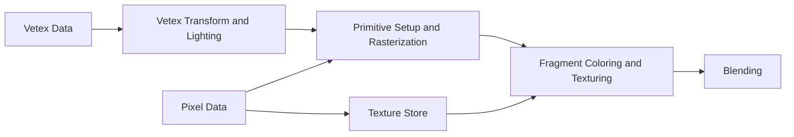

```mermaid
flowchart LR
   VD[Vetex Data]
   VTL[Vetex Transform and Lighting]
   PD[Pixel Data]
   TS[Texture Store]
   PSR[Primitive Setup and Rasterization]
   FCT[Fragment Coloring and Texturing]
   B[Blending]

   VD --> VTL --> PSR --> FCT --> B
   PD --> PSR
   PD --> TS --> FCT
```